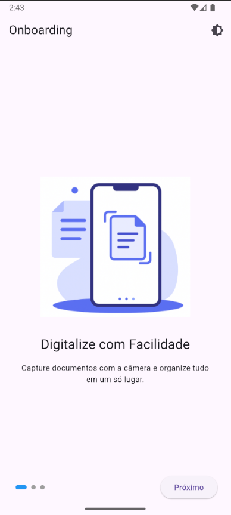
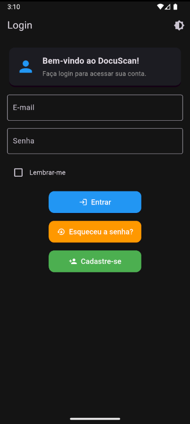
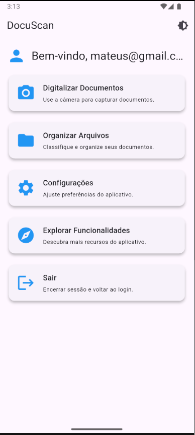

# DocuScan 📄

Bem-vindo ao **DocuScan**, um projeto acadêmico desenvolvido para aprender conceitos de desenvolvimento mobile, como login, navegação entre telas e criação de widgets personalizados. Este aplicativo não possui funcionalidades completas, mas serve como base para estudos e experimentação.

---
## 📸 Fluxo da Aplicação
Splash Nativa → Splash Animada → Onboarding → Login → Tela Inicial ou Mensagem de Boas Vindas

## 📸 Funcionalidades Implementadas

- **Tela de Login**: Interface para realizar o login de usuários.
- **Tela de Cadastro**: Permite criar uma conta .
- **Tela de Recuperação de Senha**: Simula o envio de instruções para redefinir a senha.
- **Tela Principal**: Exibe cards e botões estilizados com widgets personalizados.
- **Temas**: Um borão de temas claro e escuro para o aplicativo.
- **Widgets Personalizados**:
  - **CustomCard**: Um card reutilizável para exibir informações e ícones.
  - **CustomButton**: Um botão estilizado com ícone e texto.

---

## 🖼️ Capturas de Tela

### Tela de Onboarding


### Tela de Login tema claro


### Tela de Login tema escuro


### Tela Principal


---

## 🚀 Como Executar o Projeto

### Pré-requisitos
- Flutter instalado ([Guia de instalação](https://docs.flutter.dev/get-started/install)).
- Android Studio ou emulador configurado.
- Dispositivo físico ou emulador para execução.

### Passos
1. Clone o repositório:
   ```bash
   git clone https://github.com/seu-usuario/mobatv04.git
   ```
2. Navegue até o diretório do projeto:
   ```bash
   cd mobatv04
   ```
3. Instale as dependências:
   ```bash
   flutter pub get
   ```
4. Execute o aplicativo:
   ```bash
   flutter run
   ```

---

### 🛠️ Estrutura do Projeto
```plaintext
lib/
├── main.dart                # Ponto de entrada do aplicativo
├── screens/                 # Telas do aplicativo
│   ├── login_screen.dart    # Tela de login
│   ├── register_screen.dart # Tela de cadastro
│   ├── forgot_password_screen.dart # Tela de recuperação de senha
│   ├── home_screen.dart     # Tela principal
│   └── onboarding/          # Telas de onboarding
├── widgets/                 # Widgets reutilizáveis
│   ├── custom_button.dart   # Botão personalizado
│   ├── custom_card.dart     # Card personalizado
├── models/                  # Modelos de dados
│   └── user_model.dart      # Modelo de usuário fictício
├── database/                # Simulação de banco de dados
│   └── user_dao.dart        # DAO para manipulação de usuários fictícios
assets/
├── images/                  # Imagens do aplicativo
├── prints/                  # Prints para o README
```


---
### 📚 Objetivo do Projeto

- Criação de telas de login, cadastro e recuperação de senha.
- Uso de widgets personalizados para estilização e reutilização de componentes.
- Simulação de armazenamento local com SharedPreferences.

---


Desenvolvido por:
- [Mateus Bieger Marques](https://github.com/CocoDeLuta)
- [Erick Goncalves Da Silva](https://github.com/erick-goncalves)
- [Joao Vitor Da Silva](https://github.com/Jaaum32)